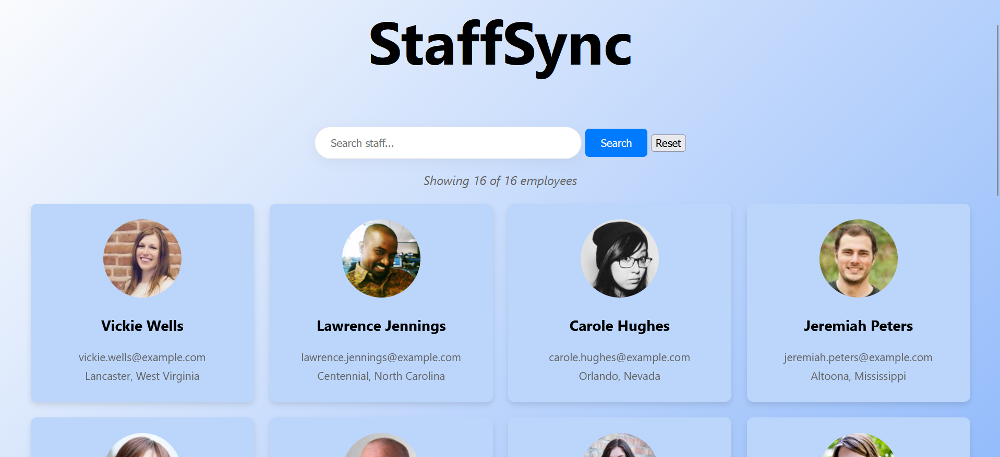

StaffSync: Employee Directory

I built this project to practice working with live data and modern JavaScript. It’s a simple, one-page dashboard that pulls a list of 16 employees from a REST API and allows you to search through them instantly.

For the logic, I used the Fetch API to grab the data and a bit of DOM manipulation to handle the search filtering. I wanted the interface to feel fast and responsive, so I used CSS Grid for the layout and added some basic fade-in animations to make the cards pop when the page loads.

I also made sure to include a search counter and a message for when no names match, just so the user always knows what is happening on the screen. It was a great way to learn how to manage a project using just pure HTML, CSS, and JavaScript without any extra frameworks.

To see it in action, you can just open index.html in your browser.